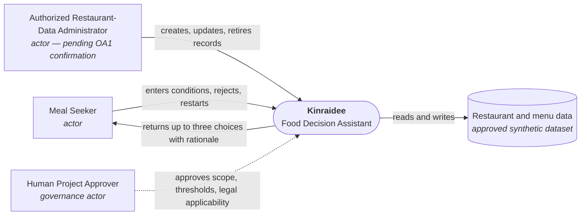
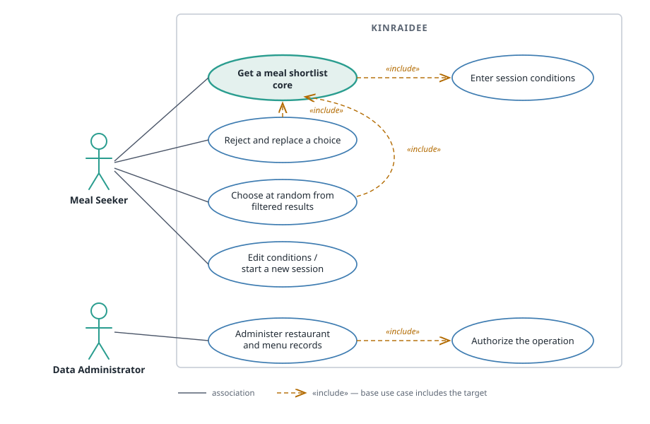
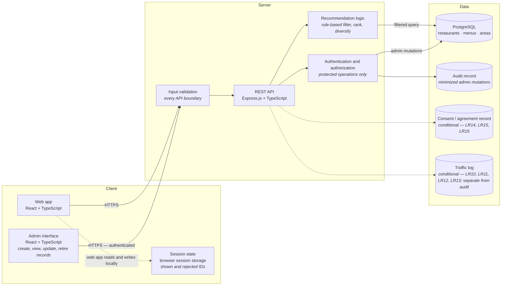
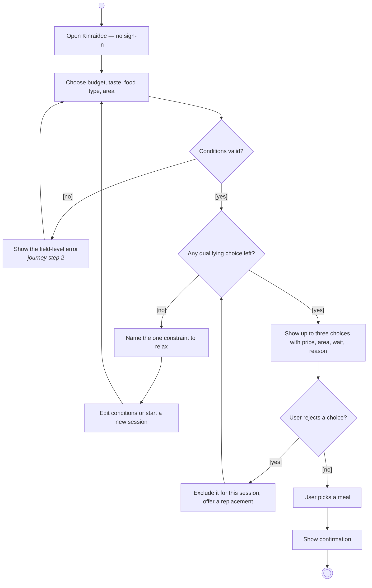

# Kinraidee Required Diagrams (D1–D4)

## Status

Draft — 2026-09-06. Pending human approval. D1, D3 and D4 are Mermaid source so they stay diffable in version control. D2 is a hand-authored SVG under `assets/`, because Mermaid has no UML use case diagram type and the required notation (stick-figure actors, ovals in a system boundary, plain associations, dashed `«include»`) cannot be expressed in a flowchart.

## Label provenance

Every label below traces to one of these approved sources:

| Source | Supplies |
|---|---|
| `.docs/01-requirements/01-spec/20260828-01-kinraidee-food-recommendation.md` | `F*`, `LR*`, `NFR*` behaviour and actors |
| `.docs/01-requirements/backlog.md` | `B*` scope items |
| `.docs/02-design/user-journey.md` | D4 step names and their order |
| `.docs/01-requirements/intent.md` | governance stakeholders — "the human project approver", drawn in D1 as `Human Project Approver` |
| Project charter §5.2 / §5.3 | the six architecture components and the technology stack in D3 |

**One exception.** The `diversify` step in D3 comes from charter §5.2 ("restaurant diversity to avoid recommending all options from the same restaurant") but has no requirement ID. It is tracked as open gap **RG-1** below and must be resolved at the W5 gate. No other label is unbacked.

---

## D1 — System Context

**Scope.** Inside the box: session conditions, filtering, shortlist, reject-and-replace, data administration. Outside and explicitly excluded: ordering, payment, delivery fulfillment, public reviews, medical dietary advice, certificate issuance.

**Traces to:** F1–F8; B1–B8; OA1; intent scope section.

---

## D2 — Use Case

Source: [`assets/d2-use-case.svg`](assets/d2-use-case.svg) — hand-authored UML, not generated, because Mermaid has no use case diagram type.

**Notation.** Actors are stick figures outside the system boundary. Use cases are ovals inside it. An actor-to-use-case association is a plain solid line with **no arrowhead**. `«include»` is a **dashed line with an open arrowhead** pointing at the included use case. The core use case is highlighted.

**Relationships shown**

| From | Kind | To | Why it is real |
|---|---|---|---|
| Get a meal shortlist | «include» | Enter session conditions | A shortlist cannot be produced without conditions (F1 gates F2) |
| Reject and replace a choice | «include» | Get a meal shortlist | Replacing re-runs the qualifying shortlist (F4, F5) |
| Choose at random from filtered results | «include» | Get a meal shortlist | Randomisation draws only from an existing filtered set (F12) |
| Administer restaurant and menu records | «include» | Authorize the operation | Every mutation is authorization-gated (F8, LR8) |

No use case requires an account (F6, LR2).

**Traces to:** F1, F2, F4, F5, F7, F8, F12, LR2, LR8; B1–B8, B14.

---

## D3 — High-level Architecture

**Stack.** React + TypeScript, Express.js + TypeScript, PostgreSQL, per the project charter §5.3.

**Components.** All six components named in charter §5.2 are present: User Interface (`Web app`), Backend API (`REST API`), Recommendation Logic, Session Management (`Session state`), Database (`PostgreSQL`), and Admin Interface.

**Open gap RG-1.** Charter §5.2 requires the recommendation logic to "consider restaurant diversity to avoid recommending all options from the same restaurant". No `F*` or `NFR*` requirement covers this. The `diversify` step is drawn here because the charter mandates it, but it is currently untraceable. The W5 gate must either add a requirement for it or record that the charter clause is not in the first release. Do not implement it until that decision is recorded. Measured against the current prototype dataset: of the 25 condition combinations that fill a three-item shortlist, 2 return all three items from a single restaurant.

**Conditional elements.** The consent record and the traffic log are drawn dashed because their activating conditions are unresolved: consent evidence applies only if consent or Terms are used (LR14, LR15, LR16), and the traffic log applies only if an accountable human confirms Computer Crime Act §26 applicability (LR10, LR11, LR12, LR13). Traffic logs are a separate store from application audit logs (LR13). No raw GPS coordinate is stored (NFR7) — no GPS store appears in this diagram.

**Traces to:** F1, F2, F3, F4, F5, F6, F7, F8; LR1, LR7, LR8, LR10, LR11, LR12, LR13, LR14, LR15, LR16; NFR1, NFR4, NFR5, NFR6, NFR7; B9, B15, B16, B17.

---

## D4 — Activity: get a meal shortlist

Steps and order are exactly `user-journey.md` steps 1–5. The `Conditions valid?` decision and its error branch belong to journey step 2 and are drawn explicitly because F1 and NFR4 require field-level validation.

Filled circle = initial node. Bullseye = final node. Diamonds are decisions; guards are in square brackets. The reject branch re-enters the qualifying check, which is what enforces non-repetition (F5, NFR9).

**Traces to:** F1, F2, F3, F4, F5, F6, F7; NFR3, NFR8, NFR9, NFR12; B1–B7; journey steps 1–5.

---

## Coverage check

| Requirement group | Covered by |
|---|---|
| F1, F2, F3, F4, F5, F6, F7 core workflow | D1, D2, D3, D4 |
| F8 administration | D1, D2, D3 |
| F12 random from filtered | D2 |
| F9, F10, F11, F13, F14, F15, F16 | Not covered — deferred, see `feature-list.md` |
| LR2, LR8 | D2, D3 |
| LR1, LR3, LR7 | D3 (data stores and log hygiene) |
| LR10, LR11, LR12, LR13, LR14, LR15, LR16 | D3, drawn conditional |
| LR4, LR5 | Not covered — both attach to deferred features (F10 exclusions, F9 location); see `prototype.md` |
| LR6, LR9 | Not covered — no persistent personal data exists yet; see `prototype.md` |
| LR17 | Not a diagram concern — no certificate issuance appears anywhere |
| NFR1, NFR3–NFR9, NFR12 | D3, D4 |
| NFR2, NFR10, NFR11 | Verification concerns, not structural — see the specification |
