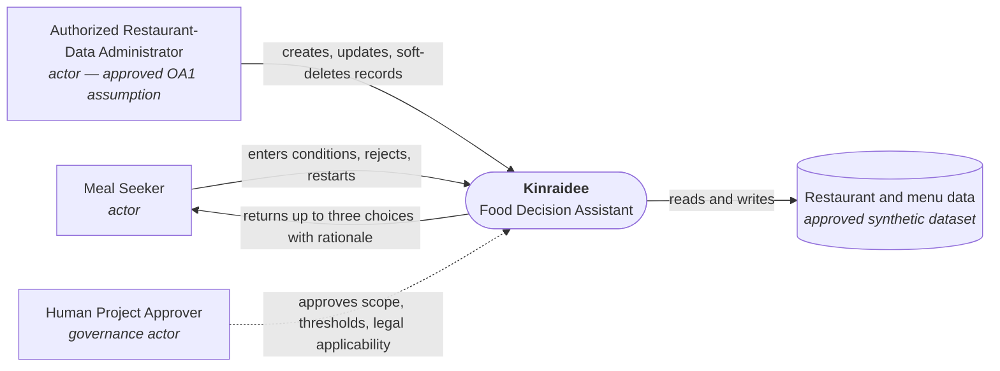
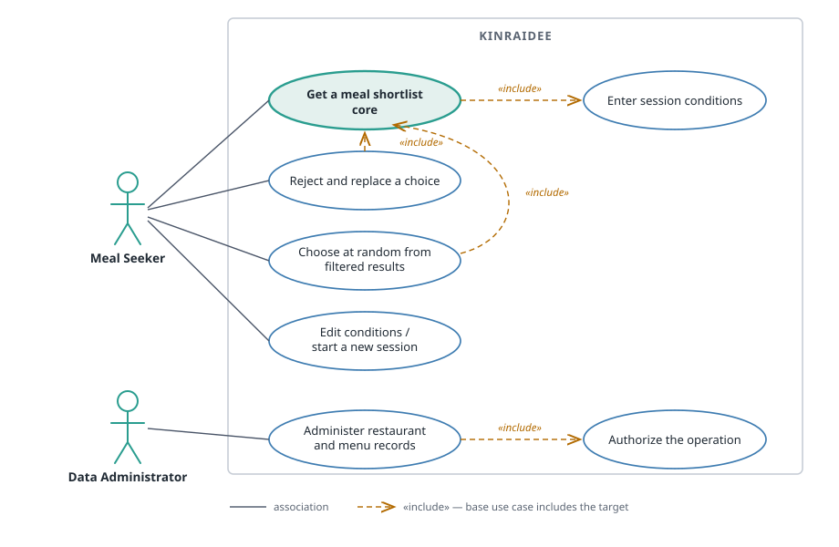
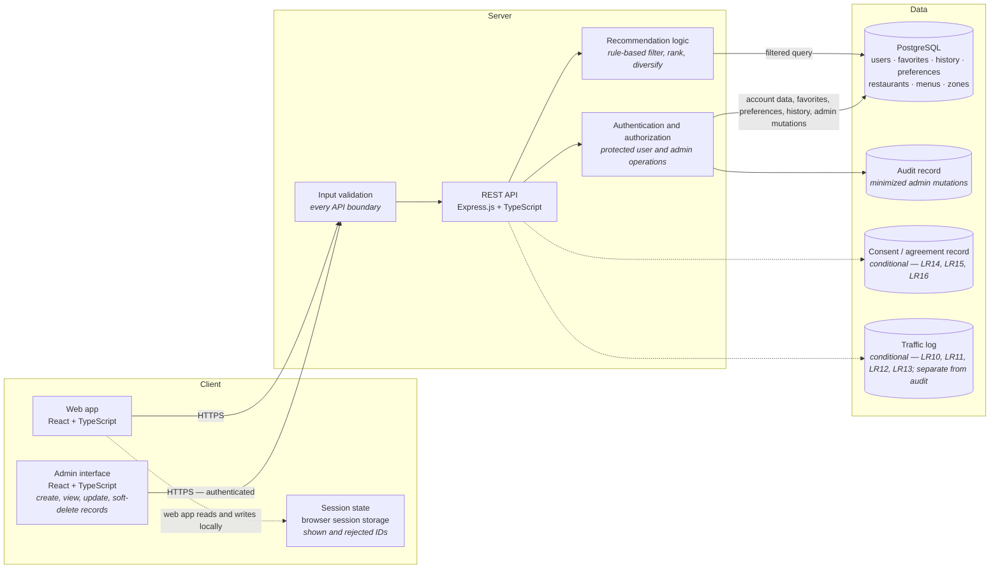
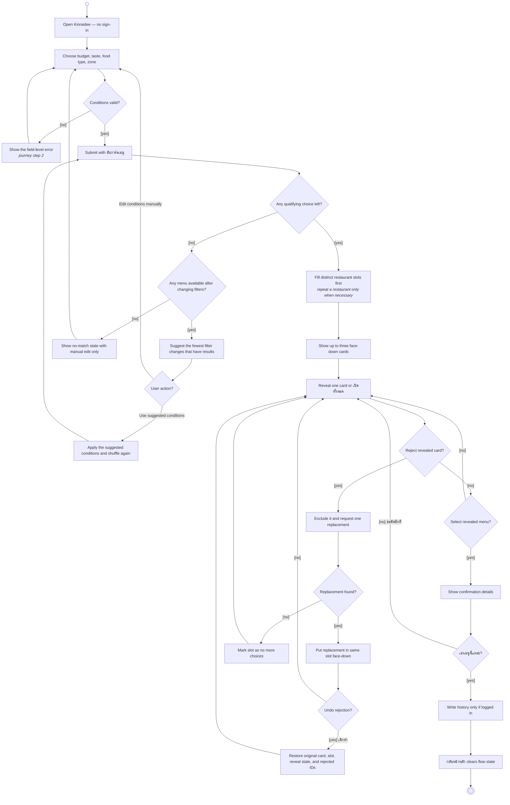

# Kinraidee Required Diagrams (D1–D4)

## Status

Approved — synchronized with the approved feature list, user journey, data model, and full-app scope on 2026-09-28. D1, D3 and D4 are Mermaid source so they stay diffable in version control. D2 is a hand-authored SVG under `assets/`, because Mermaid has no UML use case diagram type and the required notation (stick-figure actors, ovals in a system boundary, plain associations, dashed `«include»`) cannot be expressed in a flowchart.

## Label provenance

Every label below traces to one of these approved sources:

| Source | Supplies |
|---|---|
| `docs/01-requirements/01-spec/20260828-01-kinraidee-food-recommendation.md` | `F*`, `LR*`, `NFR*` behaviour and actors |
| `docs/01-requirements/backlog.md` | `B*` scope items |
| `docs/02-design/user-journey.md` | D4 step names and their order |
| `docs/01-requirements/intent.md` | governance stakeholders — "the human project approver", drawn in D1 as `Human Project Approver` |
| Project charter §5.2 / §5.3 | the six architecture components and the technology stack in D3 |

The `diversify` step in D3 traces to F19 and B24. No diagram label is intentionally unbacked.

---

## D1 — System Context

**Scope.** Inside the box: session conditions, filtering, shortlist, reject-and-replace, data administration. Outside and explicitly excluded: ordering, payment, delivery fulfillment, public reviews, medical dietary advice, certificate issuance.

**Traces to:** F1–F8; B1–B8; OA1; intent scope section.

---

## D2 — Use Case

Source: [`assets/d2-use-case.svg`](assets/d2-use-case.svg) — hand-authored UML, not generated, because Mermaid has no use case diagram type.

**Notation.** Actors are stick figures outside the system boundary. Use cases are ovals inside it. An actor-to-use-case association is a plain solid line with **no arrowhead**. `«include»` is a **dashed line with an open arrowhead** pointing at the included use case. The core use case is highlighted.

**Relationships shown**

| From | Kind | To | Why it is real |
|---|---|---|---|
| Get a meal shortlist | «include» | Enter session conditions | A shortlist cannot be produced without conditions (F1 gates F2) |
| Reject and replace a choice | «include» | Get a meal shortlist | Replacing re-runs the qualifying shortlist (F4, F5) |
| Choose at random from filtered results | «include» | Get a meal shortlist | Randomisation draws only from an existing filtered set (F12) |
| Administer catalog records | «include» | Authorize the operation | Zone, food-type, taste, restaurant, and menu-item mutations are authorization-gated (F8, LR8) |

The core meal-shortlist use case does not require an account (F6, LR2). Registered-user library and administrator use cases require authentication but do not block anonymous recommendation use.

**Traces to:** F1, F2, F4, F5, F7, F8, F12, LR2, LR8; B1–B8, B14.

---

## D3 — High-level Architecture

**Stack.** React + TypeScript, Express.js + TypeScript, PostgreSQL, per the project charter §5.3.

**Components.** All six components named in charter §5.2 are present: User Interface (`Web app`), Backend API (`REST API`), Recommendation Logic, Session Management (`Session state`), Database (`PostgreSQL`), and Admin Interface.

**Restaurant diversity.** F19/B24 require the recommendation logic to fill distinct restaurant slots first when enough qualifying restaurants exist, then allow repeated restaurants only when needed to complete the shortlist without violating filters or exclusions.

**Conditional elements.** The consent record and the traffic log are drawn dashed because their activating conditions are unresolved: consent evidence applies only if consent or Terms are used (LR14, LR15, LR16), and the traffic log applies only if an accountable human confirms Computer Crime Act §26 applicability (LR10, LR11, LR12, LR13). Traffic logs are a separate store from application audit logs (LR13). No raw GPS coordinate is stored (NFR7) — no GPS store appears in this diagram.

**Traces to:** F1, F2, F3, F4, F5, F6, F7, F8, F14, F15, F17, F18, F19; LR1, LR2, LR3, LR6, LR7, LR8, LR10, LR11, LR12, LR13, LR14, LR15, LR16; NFR1, NFR4, NFR5, NFR6, NFR7; B9, B15, B16, B17, B19, B20, B22, B23, B24.

---

## D4 — Activity: get a meal shortlist

Steps and order are exactly `user-journey.md` steps 1–5. The `Conditions valid?` decision and its error branch belong to journey step 2 and are drawn explicitly because F1 and NFR4 require field-level validation.

Filled circle = initial node. Bullseye = final node. Diamonds are decisions; guards are in square brackets. Reject replacement sends rejected and displayed menu-item IDs to the stateless recommendation API, which is what enforces non-repetition (F5, NFR9).

**Traces to:** F1, F2, F3, F4, F5, F6, F7, F19; NFR3, NFR8, NFR9, NFR12; B1–B7, B24; journey steps 1–5.

---

## Coverage check

| Requirement group | Covered by |
|---|---|
| F1, F2, F3, F4, F5, F6, F7, F19 core workflow | D1, D2, D3, D4 |
| F8 administration | D1, D2, D3 |
| F12 random from filtered | D2 |
| F10, F11, F13, F16 | Not covered — deferred, see `feature-list.md` |
| F9 | Not covered — Won't have in the first release; manual `Zone` selection is used instead |
| F14, F15, F17 registered-user library | D3 covers the persistent data store and authentication seam; detailed account screens are outside D4's anonymous-first core journey |
| LR2, LR8 | D2, D3 |
| LR1, LR3, LR7 | D3 (data stores and log hygiene) |
| LR10, LR11, LR12, LR13, LR14, LR15, LR16 | D3, drawn conditional |
| LR4 | Not covered — attaches to deferred F10 exclusions; see `prototype.md` |
| LR5 | Not covered — attaches to F9 GPS, which is Won't have in the first release |
| LR6, LR9 | Covered structurally by registered account data in D3; exact account deletion and retention behavior remains an implementation-plan and issue-level concern |
| LR17 | Not a diagram concern — no certificate issuance appears anywhere |
| NFR1, NFR3–NFR9, NFR12 | D3, D4 |
| NFR2, NFR10, NFR11 | Verification concerns, not structural — see the specification |
